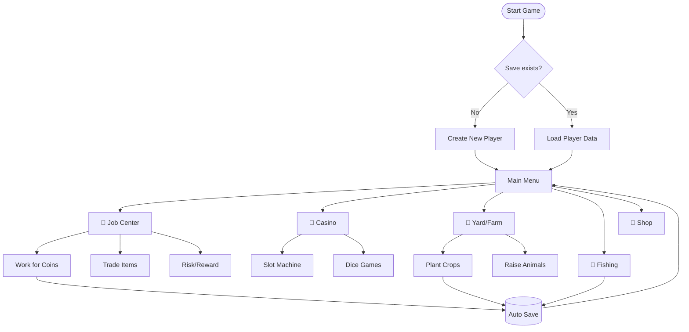
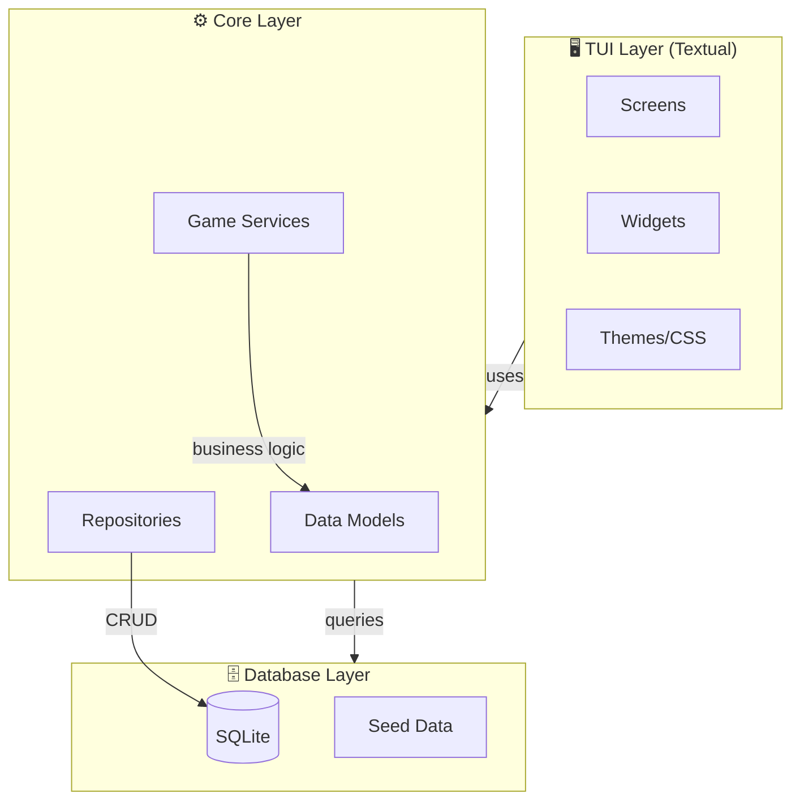
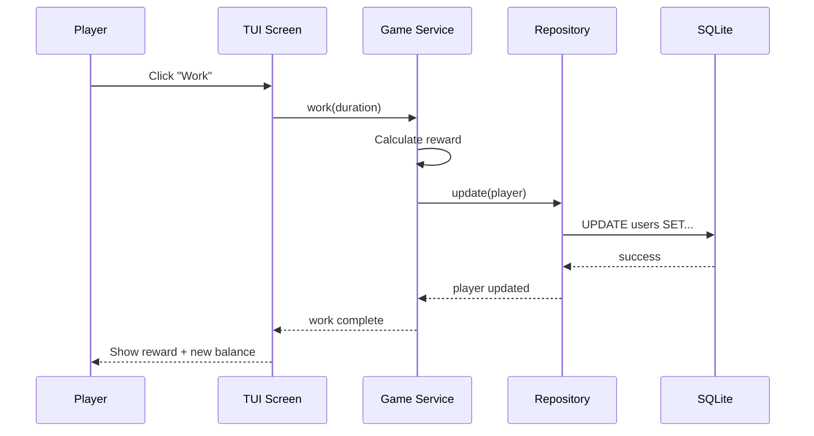

# 🎮 Hikikimo Life
    ~~SIMULASI ORANG GABUT~~

A charming life simulation game where you can farm, fish, raise animals, and build your perfect peaceful life. Experience the joy of simple living in a beautifully crafted world.

---

## 🆕 Version 2.0 - TUI Modernization

**This repository now contains the new TUI (Terminal User Interface) version** built with Python 3.12 and Textual.

### 🔙 Looking for the Legacy CLI Version?

The original command-line interface version is preserved at the **`legacy`** tag:

```bash
git checkout legacy
python main.py
```

### What's New in v2?
- Rich TUI with keyboard navigation
- SQLite backend (replacing JSON files)
- Cross-platform support (Termux, Windows, Linux, macOS)
- Modern architecture with proper MVC separation
- Enhanced features and polished UX

---

## ✨ Features

- **Fishing**: Catch rare fish in different water bodies
- **Animal Husbandry**: Raise animals and collect their products
- **Casino Games**: Try your luck with slots, blackjack, and roulette
- **Job System**: Work, trade, or take risks for rewards
- **Progression**: Level up, earn XP, and unlock new features
- **Daily Rewards**: Login daily for bonus rewards

---

## 🚀 Quick Start

### Prerequisites
- Python 3.12 or higher
- Git installed on your system

### Installation

1. **Clone the repository**:
 
```bash
   git clone https://github.com/icedeyes12/hkkm.git
   cd hkkm
```

2. **Run the new TUI version**:

```bash
   python run.py
   # Or install and run:
   pip install -e .
   hkkm
```

> Note: First run will create the database and seed game data automatically.

### Running the Legacy Version

```bash
git checkout legacy
python main.py
```

For detailed installation instructions, see [INSTALL.md](INSTALL.md).

---

## 🎯 How to Play

Hikikimo Life is a **single-player** terminal life simulation. Your progress is automatically saved to a local SQLite database.

### Starting the Game
1. Run `python run.py`
2. Click **Start Game** on the welcome screen
3. If you have a previous save, it loads automatically
4. Otherwise, a new player is created with starting balance of 🪙500

### Game Sections

| Section | Description |
|---------|-------------|
| 💼 **Job Center** | Work for steady income, trade items, or take risks |
| 🎰 **Casino** | Try your luck with slots, dice, and more |
| 🌾 **Yard** | Plant crops and raise animals for profit |
| 🎣 **Fishing** | Catch fish in different locations |
| 🛒 **Shop** | Buy tools, seeds, bait, and more |
| 🏆 **Stats** | View your progress (XP, level, balance) |

### Progression
- Earn **XP** by working, fishing, farming, and gambling
- **Level up** to unlock new features
- **Balance** is your currency for buying items and upgrades
- All progress **auto-saves** after every action

---

## 🏗️ Project Structure

```
hkkm/
├── run.py                 # Quick launcher
├── src/                   # Source code
│   ├── tui/              # Textual UI components
│   ├── core/             # Business logic
│   ├── db/               # SQLite database
│   └── config/           # Settings
├── tests/                 # Test suite
└── pyproject.toml         # Package config
```

---

## 👥 Development Team


· Namaesa
· AiharaYuu
· Mada
· AoKujira

---
## 📝 License

This project is licensed under the **MIT License** — see the [LICENSE](LICENSE) file for details.

---

## 🤝 Contributing

We welcome contributions! Please feel free to:
- Submit feature requests
- Open issues for bugs
- Fork the repository and submit pull requests

Please check the [GitHub Issues page](https://github.com/icedeyes12/hkkm/issues) for current known issues and feature requests.

---

## 🐛 Known Issues

- Game is currently in development
- Some features may be incomplete
- Balance and economy systems are being tuned

---

## 📞 Support

If you have any questions or need help, please don't ask me, I don't know what I'm doing here 🤷‍♂️
I also need help 😭

---

## 🔧 For Developers

### Game Flow



### Architecture



### Data Flow



### Project Structure (v2)

```
hkkm/
├── src/
│   ├── core/              # Business logic
│   │   ├── models/        # Data models (User, Inventory, etc.)
│   │   ├── services/      # Business services (game logic)
│   │   ├── repositories/  # Database access layer
│   │   └── exceptions/    # Custom exceptions
│   ├── tui/               # Terminal UI layer
│   │   ├── app.py         # Main TUI application
│   │   ├── screens/       # Screen components
│   │   └── widgets/       # Reusable UI components
│   ├── db/                # Database layer
│   │   ├── sqlite_manager.py
│   │   └── seed_data/
│   ├── config/            # Configuration
│   │   ├── settings.py    # Pydantic settings
│   │   └── platform.py    # Platform detection
│   └── utils/             # Utilities
│       ├── path_helper.py
│       ├── encoding.py
│       └── validators.py
├── tests/                 # Test suite
├── scripts/               # Migration scripts
└── assets/                # Game assets
```

### Configuration

Settings can be configured via environment variables:

```bash
# Database
HKKM_DB__URL=sqlite:///custom.db
HKKM_DB__ECHO=true

# TUI
HKKM_TUI__THEME=dark
HKKM_TUI__ANIMATION_SPEED=1.5

# Game
HKKM_GAME__STARTING_BALANCE=1000
HKKM_GAME__MAX_LEVEL=20
```

Or create a `.env` file in the project root.

### Migration from v1

If you have existing JSON save files from v1:

```bash
python scripts/migrate_data.py
```

This will convert your users.json and game data to the new SQLite format.

### Development Setup

```bash
pip install -e ".[dev]"
```

### Running Tests

```bash
pytest
```

### Code Style

```bash
black src tests
ruff check src tests
mypy src
```

### Keyboard Shortcuts

| Key | Action |
|-----|--------|
| `Tab` | Navigate between widgets |
| `Enter` | Select/confirm |
| `↑/↓` or `j/k` | Navigate lists |
| `Esc` or `q` | Back/cancel |
| `F1` | Help |

Enable vim mode with `HKKM_TUI__VIM_MODE=true`.

---

Enjoy your peaceful life in Hikikimo! 🌿🐟🌻
Built with love and 愛(ai) for the gaming community 💕,
